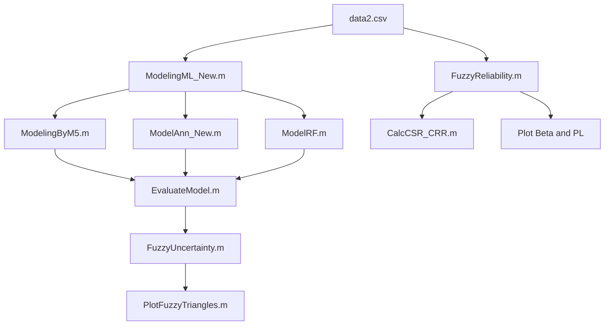
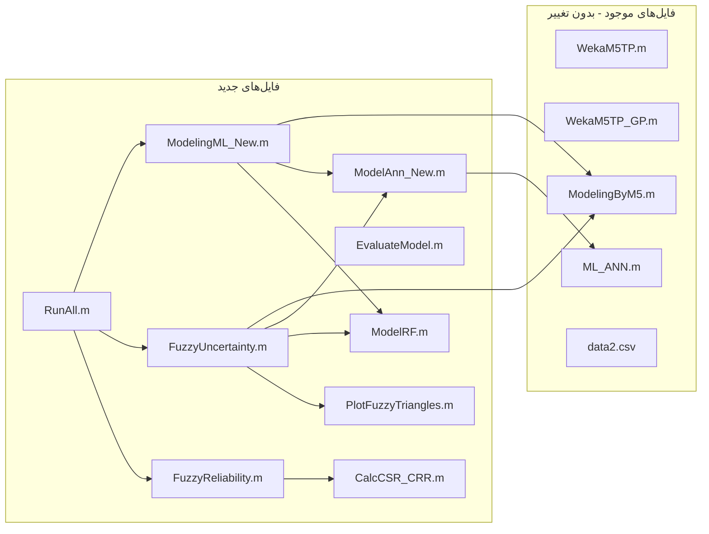

# پلن پیاده‌سازی تحلیل عدم قطعیت فازی روانگرایی

## وضعیت فعلی

کدهای موجود ۴ مدل (M5P, M5GP, ANN, Tree) را اجرا می‌کنند. مشکلات شناسایی شده:

- **Tree** دچار overfitting شدید (Train AUC=0.99, Test AUC=0.87)
- **ModelAnn.m** باگ در ترتیب Confusion Matrix دارد: خط ۱۴۳ `[TP,FP;TN,FN]` باید `[TP,FP;FN,TN]` باشد
- تحلیل عدم قطعیت فقط جابجایی تصادفی داده‌ها بوده، نه تحلیل فازی واقعی

## معماری کلی




---

## فاز ۱: اصلاح و ایجاد مدل‌ها

### ۱.۱ ایجاد `ModelRF.m` (Random Forest)

ساختار مشابه [ModelTree.m](ModelTree.m) ولی با `TreeBagger`:

```matlab
function [Answer_Train,Answer_Test,Answer2,CTime] = ModelRF(Data)
  % Split 70/30
  % Train: B = TreeBagger(100, Input_Train, Target_Train, 'Method','classification');
  % Predict: [~, Score] = predict(B, Input); Score_Train = str2double(Score(:,2));
  % Threshold at 0.5, Confusion Matrix, Metrics, ROC
end
```

- 100 درخت، Method = classification
- خروجی Score پیوسته (احتمال کلاس ۱) برای ROC/AUC
- همان ساختار خروجی: `[Answer_Train, Answer_Test, Answer2, CTime]`

### ۱.۲ اصلاح `ModelAnn.m` --> `ModelAnn_New.m`

- رفع باگ Confusion Matrix (خط ۱۴۳ و ۱۵۴: swap FN و TN)
- حذف حالت `Pre_Trained` چون ANN_net.mat موجود نیست
- بهبود: استفاده از `fitcnet` (اگر متلب جدید) یا اصلاح `patternnet` فعلی
- اطمینان از خروجی Score پیوسته برای AUC

### ۱.۳ ایجاد `EvaluateModel.m` (تابع مشترک ارزیابی)

برای جلوگیری از تکرار کد، یک تابع واحد برای محاسبه تمام شاخص‌ها:

```matlab
function [metrics] = EvaluateModel(Target, Score, threshold)
  % metrics.Precision, metrics.OA, metrics.F1, metrics.Recall, metrics.MCC, metrics.AUC
end
```

### ۱.۴ به‌روزرسانی اسکریپت اصلی --> `ModelingML_New.m`

- اجرای ۳ مدل: M5P, ANN, RF
- جمع‌آوری نتایج + رسم ROC مقایسه‌ای (۳ مدل روی یک نمودار)
- ذخیره نتایج در `Results_New.mat`

---

## فاز ۲: تحلیل عدم قطعیت فازی

### ۲.۱ ایجاد `FuzzyUncertainty.m` (ماژول اصلی)

منطق اصلی بر اساس مقاله ایرانی (Ghasemi & Derakhshani, 2021):

```matlab
% COV values from Kumar et al. (2023) Table 1
COV = [0, 0.4, 0.35, 0.2, 0.2, 0.1, 0.2]; % Z(fixed), N60, F, Si, Si1, Mw, a
alpha_levels = [1.0, 0.8, 0.6, 0.4, 0.2, 0.0];

for each alpha:
    delta = (1 - alpha) * COV .* Data(:,1:7);  % uncertainty range
    for n_samples = 1:N (e.g. 200):
        perturbed_data = Data(:,1:7) + delta .* (2*rand-1);  % random within alpha-bounds
        run M5P, ANN, RF on perturbed_data
        record OA, Precision, Recall, F1, MCC, AUC
    end
    store min/max of each metric at this alpha
end
```

- ۶ سطح alpha-cut
- N=200 نمونه تصادفی در هر سطح (مونت‌کارلو)
- ثبت min و max هر شاخص در هر سطح alpha
- Z (عمق) ثابت نگه داشته می‌شود (COV=0)

### ۲.۲ ایجاد `PlotFuzzyTriangles.m` (رسم نمودارها)

مشابه Fig. 5, 6, 7 مقاله ایرانی:

- ۶ نمودار مثلثی (یکی برای هر شاخص: OA, Precision, Recall, F1, MCC, AUC)
- در هر نمودار: ۳ مثلث (M5P آبی، ANN قرمز، RF سبز)
- محور X: مقدار شاخص، محور Y: سطح alpha

---

## فاز ۳: رویکرد مقاله هندی (beta و PL فازی)

### ۳.۱ ایجاد `CalcCSR_CRR.m`

پیاده‌سازی فرمول‌های Idriss & Boulanger (2008) از مقاله Kumar:

```matlab
function [CSR, CRR, FS, PL] = CalcCSR_CRR(Z, N60, FC, Si, Si1, Mw, amax)
  % Eq.1: CSR = 0.65 * (Si/Si1) * (amax/g) * (rd/MSF) * (1/Kσ)
  % Eq.2: CRR = exp((N1)60cs/14.1 + ... - 2.8)
  % Eq.3-4: (N1)60cs correction for fines content
  % Eq.5: FS = CRR/CSR
  % Eq.7-8: beta = (mean(FS)-1)/std(FS), PL = 1 - normcdf(beta)
end
```

### ۳.۲ ایجاد `FuzzyReliability.m`

- فازی‌سازی ورودی‌ها (مثل فاز ۲) با COV مقاله هندی
- در هر سطح alpha: محاسبه CRR, CSR, FS برای نمونه‌های اختلال‌یافته
- محاسبه beta و PL فازی
- رسم مثلث‌های فازی beta و PL
- مقایسه PL فازی با خروجی واقعی L

---

## فاز ۴: جمع‌بندی و خروجی نهایی

### ۴.۱ ایجاد `RunAll.m` (اسکریپت نهایی)

اسکریپتی که همه مراحل را به ترتیب اجرا کند:

1. اجرای ۳ مدل و چاپ نتایج دقت
2. اجرای تحلیل عدم قطعیت فازی
3. رسم مثلث‌های فازی شاخص‌های ارزیابی
4. اجرای تحلیل beta/PL فازی
5. ذخیره همه نتایج و نمودارها

### خروجی‌های نهایی:

- جدول مقایسه‌ای ۳ مدل (Precision, OA, F1, Recall, MCC, AUC)
- ۳ نمودار ROC (یکی برای هر مدل + مقایسه‌ای)
- ۶ نمودار مثلثی فازی (OA, Precision, Recall, F1, MCC, AUC)
- جدول عرض Support مثلث‌ها (کمی‌سازی Robustness)
- نمودار مثلثی beta و PL

---

## ترتیب فایل‌ها و وابستگی‌ها




